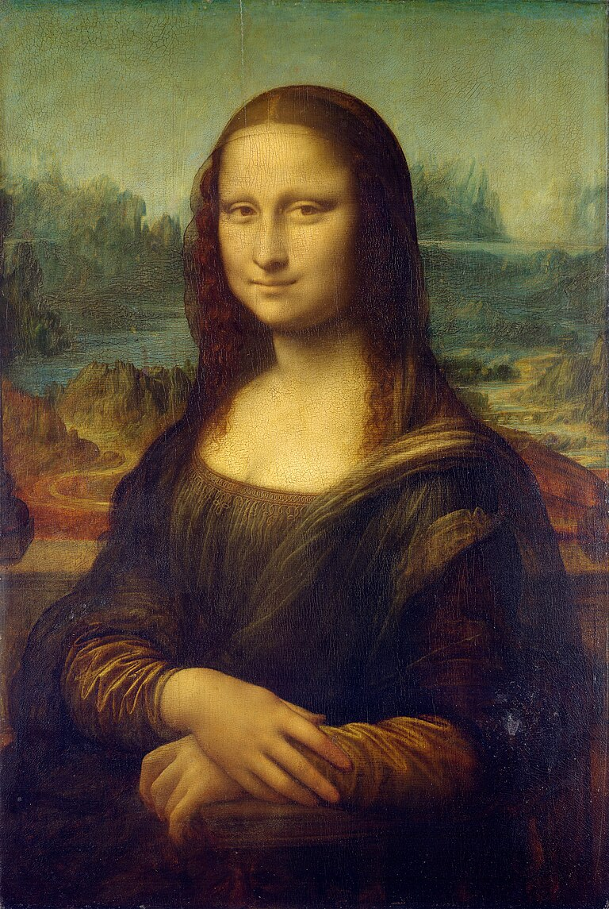
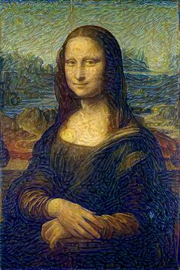
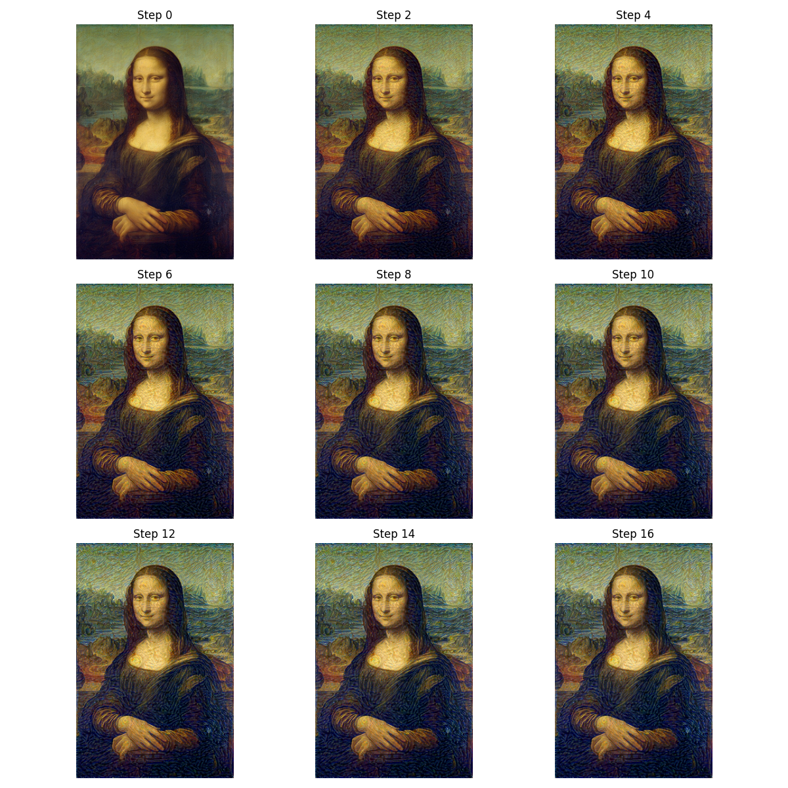

# Neural Style Transfer with Perceptual Loss

This project implements neural style transfer using perceptual loss as described in the paper ["Perceptual Losses for Real-Time Style Transfer and Super-Resolution"](https://arxiv.org/pdf/1603.08155) by Johnson et al. (2016).

## Overview

Neural style transfer is a technique that combines the content of one image with the style of another image. This implementation uses a pre-trained VGG16 network to extract features from content and style images, and optimizes an input image to match the content features of the content image and the style features of the style image.

## Features

- Uses VGG16 for feature extraction
- Implements perceptual loss (content loss + style loss)
- Allows adjustment of style intensity by tuning weights
- Saves intermediate results during optimization
- Logs processing time and loss history
- Preserves aspect ratio of input images

## Project Structure

```
.
├── data/
│   ├── content.jpg       # Content image (Mona Lisa)
│   └── style.jpg         # Style image (The Starry Night)
├── models/
│   └── saved_models/     # Directory for saved models
├── results/
│   ├── figures/          # Directory for output images
│   │   ├── stylized.jpg  # Final stylized image
│   │   └── intermediate_results.png  # Grid of intermediate results
│   └── processing_time.txt  # Log of processing time
└── src/
    ├── model.py          # Implementation of VGG16 feature extractor and perceptual loss
    └── main.py           # Main script for style transfer
```

## Usage

```bash
python src/main.py --content data/content.jpg --style data/style.jpg --output results/figures/stylized.jpg --steps 300 --content-weight 1.0 --style-weight 1e6
```

### Arguments

- `--content`: Path to content image (default: `data/content.jpg`)
- `--style`: Path to style image (default: `data/style.jpg`)
- `--output`: Path to output image (default: `results/figures/stylized.jpg`)
- `--content-size`: Size to resize content image to (default: 512)
- `--style-size`: Size to resize style image to (default: 512)
- `--content-weight`: Weight for content loss (default: 1.0)
- `--style-weight`: Weight for style loss (default: 1e6)
- `--steps`: Number of optimization steps (default: 300)
- `--lr`: Learning rate for optimization (default: 0.01)
- `--device`: Device to run the model on (default: cuda if available, otherwise cpu)
- `--log-interval`: Interval for logging progress (default: 50)
- `--intermediate-path`: Path to save intermediate results (default: `results/figures/intermediate_results.png`)

## Examples

### Original Images

Content Image (Mona Lisa):


Style Image (The Starry Night):


### Stylized Image



### Intermediate Results



## References

- Johnson, J., Alahi, A., & Fei-Fei, L. (2016). Perceptual losses for real-time style transfer and super-resolution. In European conference on computer vision (pp. 694-711). Springer, Cham.
- Gatys, L. A., Ecker, A. S., & Bethge, M. (2016). Image style transfer using convolutional neural networks. In Proceedings of the IEEE conference on computer vision and pattern recognition (pp. 2414-2423).