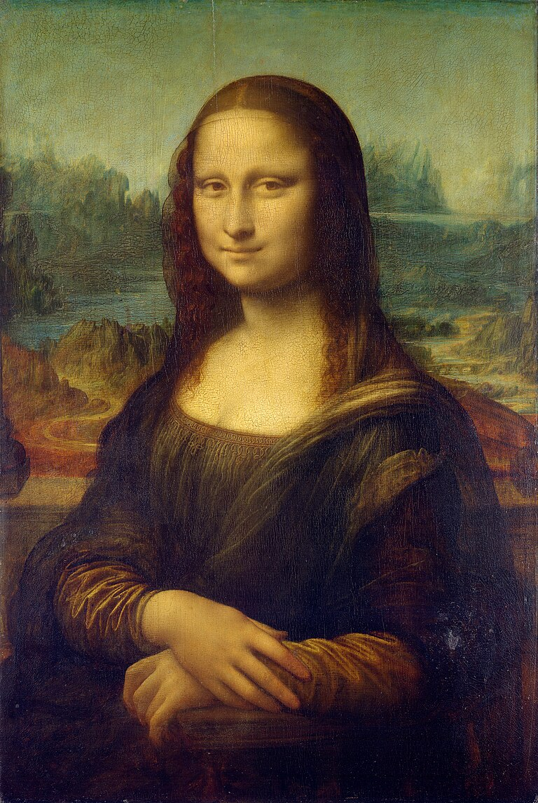
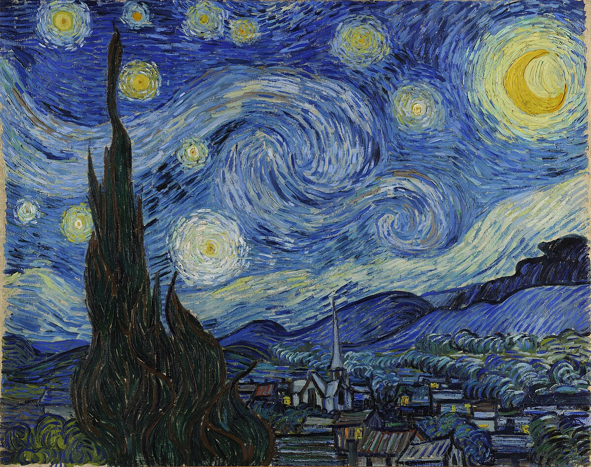
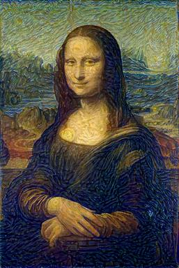
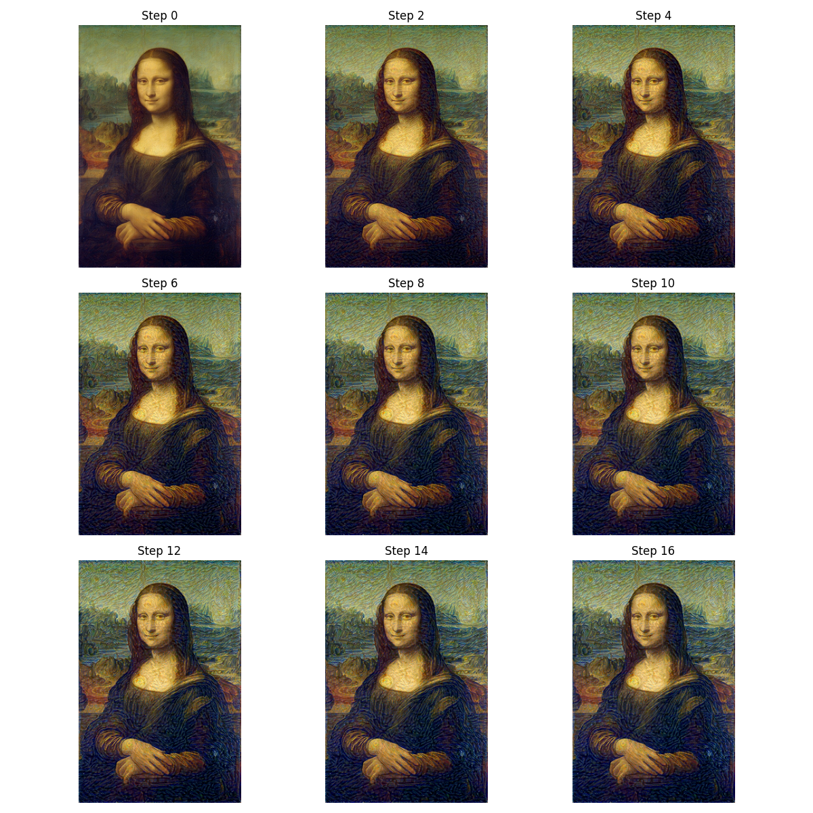
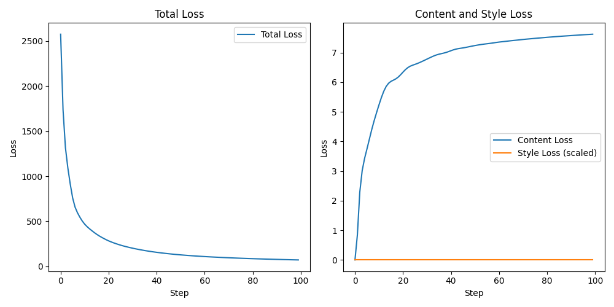

# Neural Style Transfer with Perceptual Loss

This project implements neural style transfer using perceptual loss as described in the paper ["Perceptual Losses for Real-Time Style Transfer and Super-Resolution"](https://arxiv.org/pdf/1603.08155) by Johnson et al. (2016).

## Overview

Neural style transfer is a technique that combines the content of one image with the style of another image. This implementation uses a pre-trained VGG16/VGG19 network to extract features from content and style images, and optimizes an input image to match the content features of the content image and the style features of the style image.

## Features

- Uses VGG16/VGG19 for feature extraction
- Implements perceptual loss (content loss + style loss)
- Allows adjustment of style intensity by tuning weights
- Saves intermediate results during optimization
- Logs processing time and loss history
- Preserves aspect ratio of input images
- Includes a web viewer for visualizing results

## Project Structure

```
.
├── data/
│   ├── content.jpg       # Content image (Mona Lisa)
│   └── style.jpg         # Style image (The Starry Night)
├── results/
│   ├── figures/          # Directory for output images
│   │   ├── stylized.jpg  # Final stylized image
│   │   ├── intermediate_results.png  # Grid of intermediate results
│   │   └── loss_history.png  # Plot of loss history
│   └── processing_time.txt  # Log of processing time
└── src/
    ├── model.py          # Implementation of VGG16 feature extractor and perceptual loss
    ├── main.py           # Main script for style transfer
    ├── fast_style_transfer.py  # Faster implementation using VGG19
    └── web_viewer.py     # Web interface for viewing results
```

## Usage

### Running Style Transfer

```bash
# Using the original implementation
python src/main.py --content data/content.jpg --style data/style.jpg --output results/figures/stylized.jpg --steps 300 --content-weight 1.0 --style-weight 1e6

# Using the faster implementation
python src/fast_style_transfer.py --content data/content.jpg --style data/style.jpg --output results/figures/stylized.jpg --steps 100 --content-weight 1.0 --style-weight 1e7 --max-size 384
```

### Viewing Results

```bash
python src/web_viewer.py --port 12000
```

Then open your browser and navigate to `http://localhost:12000` to view the results.

### Arguments

#### Original Implementation (main.py)

- `--content`: Path to content image (default: `data/content.jpg`)
- `--style`: Path to style image (default: `data/style.jpg`)
- `--output`: Path to output image (default: `results/figures/stylized.jpg`)
- `--content-size`: Size to resize content image to (default: 512)
- `--style-size`: Size to resize style image to (default: 512)
- `--content-weight`: Weight for content loss (default: 1.0)
- `--style-weight`: Weight for style loss (default: 1e6)
- `--steps`: Number of optimization steps (default: 300)
- `--lr`: Learning rate for optimization (default: 0.01)
- `--device`: Device to run the model on (default: cuda if available, otherwise cpu)
- `--log-interval`: Interval for logging progress (default: 50)
- `--intermediate-path`: Path to save intermediate results (default: `results/figures/intermediate_results.png`)

#### Fast Implementation (fast_style_transfer.py)

- `--content`: Path to content image (default: `data/content.jpg`)
- `--style`: Path to style image (default: `data/style.jpg`)
- `--output`: Path to output image (default: `results/figures/stylized.jpg`)
- `--steps`: Number of optimization steps (default: 100)
- `--content-weight`: Weight for content loss (default: 1.0)
- `--style-weight`: Weight for style loss (default: 1e6)
- `--max-size`: Maximum image size (default: 384)
- `--log-interval`: Logging interval (default: 10)
- `--intermediate-path`: Path to save intermediate results (default: `results/figures/intermediate_results.png`)

## Examples

### Original Images

Content Image (Mona Lisa):


Style Image (The Starry Night):


### Stylized Image



### Intermediate Results



### Loss History



## Performance

The fast implementation using VGG19 and Adam optimizer can complete 100 steps of style transfer in about 90 seconds on a CPU for images with a maximum dimension of 384 pixels. The original implementation using VGG16 and LBFGS optimizer is slower but may produce better results in some cases.

## References

- Johnson, J., Alahi, A., & Fei-Fei, L. (2016). Perceptual losses for real-time style transfer and super-resolution. In European conference on computer vision (pp. 694-711). Springer, Cham.
- Gatys, L. A., Ecker, A. S., & Bethge, M. (2016). Image style transfer using convolutional neural networks. In Proceedings of the IEEE conference on computer vision and pattern recognition (pp. 2414-2423).